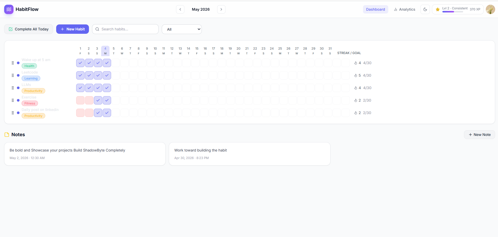
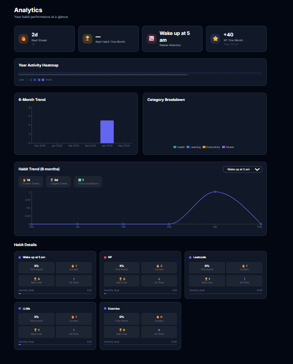
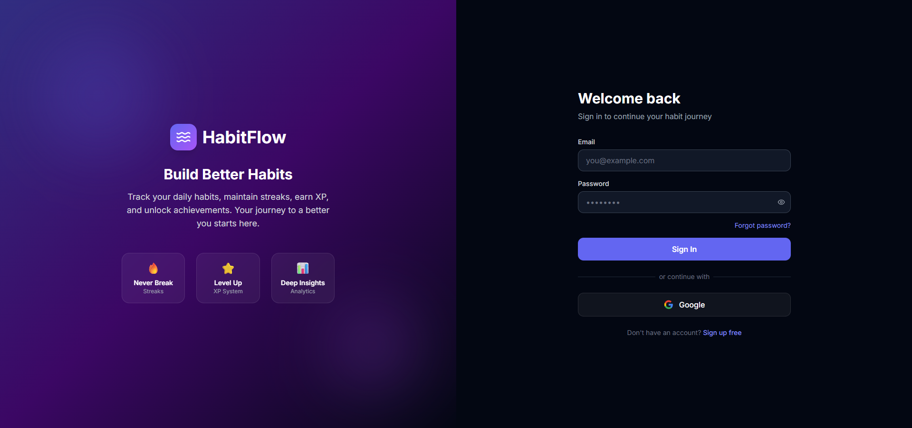

# 🌊 HabitFlow — Daily Habit Tracker

<div align="center">


[](https://nodejs.org)
[](https://reactjs.org)
[](https://mongodb.com)
[](https://expressjs.com)
[](https://vitejs.dev)
[](LICENSE)

**Track your daily habits, maintain streaks, earn XP, and unlock achievements.**  
Your journey to a better you starts here.

[🌐 Live Demo](https://habitflow-app-qcho.onrender.com/) · [Report Bug](issues) · [Request Feature](issues)

</div>

---

## 📸 Screenshots

| Dashboard | Analytics | Login |
|-----------|-----------|-------|
|  |  |  |

---

## ✨ Features

| Category | Features |
|----------|----------|
| 📅 **Habit Tracking** | Monthly grid view, daily completions, soft delete & archive |
| 🔥 **Streaks** | Current streak, longest streak, streak-based XP multipliers |
| ⭐ **Gamification** | XP & Level system (5 levels), 7 unlockable badges, confetti on full completion |
| 📊 **Analytics** | Year activity heatmap, 6-month trend, category breakdown, per-habit charts |
| 📝 **Notes** | Markdown-supported notes with timestamps |
| 🔐 **Auth** | JWT authentication + Google OAuth, password reset via email |
| 🌙 **UX Polish** | Dark mode, drag & drop reordering, 5-second undo toggle, keyboard shortcuts |
| 🌐 **Social** | Public profile pages, CSV data export |

---

## 🛠️ Tech Stack

**Backend**
- **Node.js** + **Express.js** — REST API server
- **MongoDB** + **Mongoose** — Database & ODM
- **Passport.js** — JWT + Google OAuth strategies
- **Nodemailer** — Transactional emails for password reset

**Frontend**
- **React 18** + **Vite** — Fast SPA with hot module replacement
- **React Context API** — Global state for Auth, Theme, Habits
- **Axios** — HTTP client with interceptors
- **Recharts** — Analytics visualizations

---

## 🚀 Quick Start

### Prerequisites
- Node.js 18+
- MongoDB (local or [Atlas](https://cloud.mongodb.com))

### 1. Clone & Install
```bash
git clone https://github.com/yourusername/habitflow.git
cd habitflow

# Install all dependencies (root + server + client)
npm install
cd server && npm install && cd ..
cd client && npm install && cd ..
```

### 2. Configure Environment
Create `server/.env` (copy from `server/.env.example`):

```env
# Database
MONGO_URI=mongodb://localhost:27017/habitflow

# Auth
JWT_SECRET=your_super_secret_key_here
JWT_EXPIRES_IN=7d

# Google OAuth (optional)
GOOGLE_CLIENT_ID=your_google_client_id
GOOGLE_CLIENT_SECRET=your_google_client_secret
GOOGLE_CALLBACK_URL=http://localhost:5000/api/auth/google/callback

# Email (for password reset)
SMTP_HOST=smtp.gmail.com
SMTP_USER=your@gmail.com
SMTP_PASS=your_app_password

# Client
CLIENT_URL=http://localhost:5173
```

### 3. Run Development
```bash
# Start both server + client concurrently
npm run dev
```

Or run separately:
```bash
npm run server   # Express API on :5000
npm run client   # Vite React on :5173
```

---

## 📁 Project Structure

```
HabitFlow/
├── server/                     # Express.js backend
│   ├── config/
│   │   ├── db.js               # MongoDB connection
│   │   └── passport.js         # OAuth strategies
│   ├── controllers/            # Route handlers
│   ├── middleware/
│   │   ├── auth.js             # JWT verification
│   │   └── errorHandler.js
│   ├── models/
│   │   ├── User.js             # User schema + XP/levels
│   │   ├── Habit.js            # Habit schema + completions
│   │   └── Note.js
│   ├── routes/                 # API route definitions
│   ├── utils/
│   │   ├── streak.js           # Streak calculation logic
│   │   ├── xp.js               # XP & leveling system
│   │   ├── badges.js           # Badge unlock logic
│   │   └── email.js            # Nodemailer templates
│   └── server.js
│
└── client/                     # Vite + React frontend
    └── src/
        ├── api/                # Axios API functions
        ├── components/         # Reusable UI components
        ├── context/
        │   ├── AuthContext.jsx
        │   ├── ThemeContext.jsx
        │   └── HabitContext.jsx
        ├── pages/              # Dashboard, Analytics, Profile
        └── utils/              # Date helpers, badge utils
```

---

## 🔌 API Reference

### Auth
| Method | Endpoint | Description |
|--------|----------|-------------|
| `POST` | `/api/auth/register` | Create account |
| `POST` | `/api/auth/login` | Login (returns JWT) |
| `GET` | `/api/auth/me` | Get current user |
| `GET` | `/api/auth/google` | Google OAuth redirect |
| `POST` | `/api/auth/forgot-password` | Send reset email |
| `POST` | `/api/auth/reset-password/:token` | Reset password |

### Habits
| Method | Endpoint | Description |
|--------|----------|-------------|
| `GET` | `/api/habits` | List all habits |
| `POST` | `/api/habits` | Create habit |
| `PUT` | `/api/habits/:id` | Update habit |
| `DELETE` | `/api/habits/:id` | Soft delete |
| `PATCH` | `/api/habits/:id/toggle` | Toggle today's completion |
| `PATCH` | `/api/habits/:id/archive` | Archive habit |
| `PATCH` | `/api/habits/reorder` | Drag & drop reorder |

### Analytics
| Method | Endpoint | Description |
|--------|----------|-------------|
| `GET` | `/api/analytics/summary` | Overall stats |
| `GET` | `/api/analytics/heatmap` | Year activity heatmap |
| `GET` | `/api/analytics/monthly` | Monthly breakdown |
| `GET` | `/api/analytics/habits/:id` | Individual habit trend |

### Other
| Method | Endpoint | Description |
|--------|----------|-------------|
| `GET` | `/api/notes` | Get notes |
| `POST` | `/api/notes` | Create note |
| `DELETE` | `/api/notes/:id` | Delete note |
| `PUT` | `/api/user/settings` | Update user settings |
| `DELETE` | `/api/user` | Delete account |
| `GET` | `/api/user/:username/public` | Public profile |
| `GET` | `/api/export/csv` | Export habits as CSV |

---

## ⌨️ Keyboard Shortcuts

| Key | Action |
|-----|--------|
| `N` | Create new habit |
| `A` | Complete all habits for today |
| `Esc` | Close any open modal |

---

## 🏅 Gamification System

### XP & Levels
| Level | Title | XP Required |
|-------|-------|-------------|
| 1 | Beginner | 0 |
| 2 | Consistent | 100 |
| 3 | Dedicated | 300 |
| 4 | Champion | 600 |
| 5 | Legend | 1000 |

### Badges (7 Unlockable)
Badges are awarded for milestones like first completion, 7-day streak, 30-day streak, completing all habits in a day, and more.

---

## 🚢 Deployment

### Backend (Railway / Render)
1. Set environment variables from `.env`
2. Set `NODE_ENV=production`
3. Start command: `node server/server.js`

### Frontend (Vercel / Netlify)
1. Build command: `cd client && npm run build`
2. Output directory: `client/dist`
3. Set `VITE_API_URL` to your backend URL

### MongoDB Atlas
1. Create a free cluster at [cloud.mongodb.com](https://cloud.mongodb.com)
2. Whitelist your server IP
3. Update `MONGO_URI` in your environment

---

## 🤝 Contributing

Contributions are welcome! Please follow these steps:

1. Fork the repository
2. Create a feature branch: `git checkout -b feature/amazing-feature`
3. Commit your changes: `git commit -m 'Add amazing feature'`
4. Push to the branch: `git push origin feature/amazing-feature`
5. Open a Pull Request

---

## 📄 License

This project is licensed under the MIT License — see the [LICENSE](LICENSE) file for details.

---

<div align="center">

Built with ❤️ using the MERN stack

⭐ **Star this repo if you found it helpful!**

</div>
